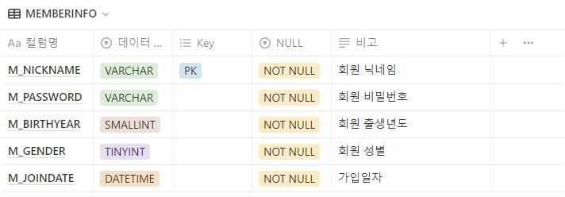
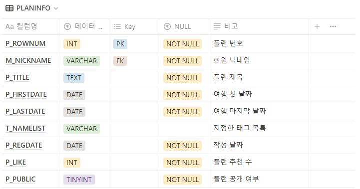
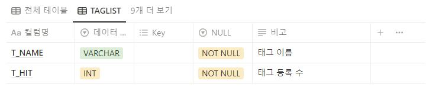
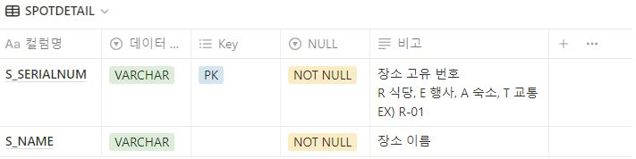
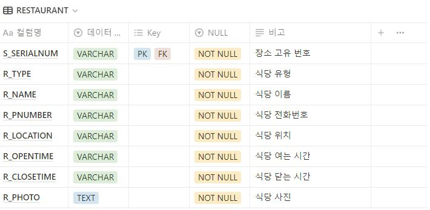
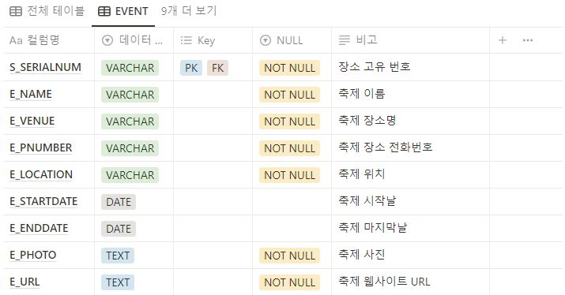
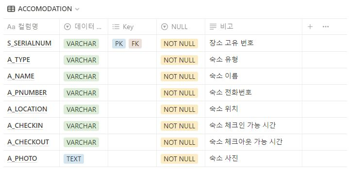
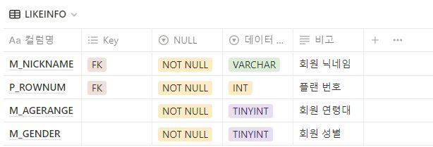
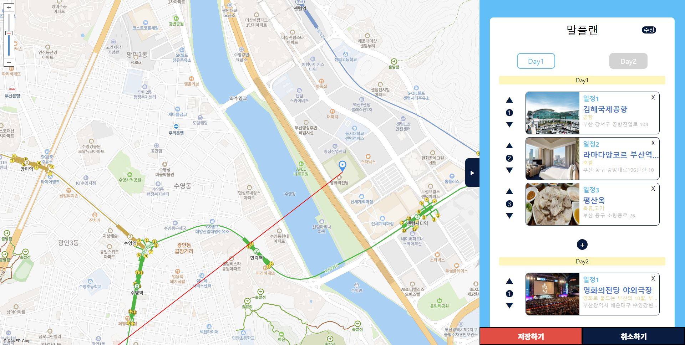

# 2022-Buna Project

## 💻 프로젝트 소개
- **프로젝트명** : 부랑나랑 (Buna)
- **프로젝트 기간** : 2022.09.14 ~ 2022.09.29 / 2022.10.10 ~
- 간편하게 부산 여행 계획을 짤 수 있는 부산 만의 여행 플래너 웹사이트

## 👀 멤버 소개
- **김규빈**
	- Team Leader
	- 웹사이트 기획 및 DB (~~Oracle DB~~ -> MySQL) 구축
	- 새 플랜 작성 Modal 페이지 구현
		- Java, Spring Framework, JSP, HTML, CSS, Javascript ( + JQuery, FullCalendar) 사용
	- 새 플랜 작성, 플랜 수정, 여행 일정표 페이지의 지도 API 구현
		- ~~카카오 맵~~ -> 네이버 맵 Open API ( + Javascript) 사용	 
- **한애채**
	- 웹사이트 기획 및 DB (~~Oracle DB~~ -> MySQL) 구축
	- 새 플랜 작성, 플랜 수정 페이지 구현
		- Java, Spring Framework, JSP, HTML, CSS, Javascript ( + JQuery) 사용 
- **한병태**
	- 웹사이트 기획 및 DB (~~Oracle DB~~ -> MySQL) 구축
	- Main Page, 로그인 / 회원가입 페이지 구현
		-  Java, Spring Framework, JSP, HTML, CSS, Javascript ( + JQuery, FullCalendar) 사용
- **강승구**
	-  웹사이트 기획 및 DB (~~Oracle DB~~ -> MySQL) 구축
	-  인기 여행 플랜, 행사 / 이벤트 페이지 구현
		-  Java, Spring Framework, JSP, HTML, CSS, Javascript ( + JQuery, Bootstrap) 사용
- **장희정**
	- 웹사이트 기획 및 DB (~~Oracle DB~~ -> MySQL) 구축
	- 여행 일정표, My Page 페이지 구현
		-  Java, Spring Framework, JSP, HTML, CSS, Javascript ( + JQuery) 사용

## ⚒ 사용 기술 및 개발 환경
OS : Windows 10

Tools : ~~Eclipse 2020-06~~ -> IntellJ IDEA, ~~Oracle SQL Developer~~ -> MySQL Workbench 8.0

Frondend : HTML5, CSS3, Javascript( + JQuery, Bootstrap, FullCalendar)

Backend : JAVA 8, Spring Framework, JSP

Database : ~~Oracle XE 11g~~ -> MySQL 8.0

Build Tool : Maven 3.6

Web Application Server : Apache Tomcat 9

Open API : ~~카카오 지도 API~~ -> 네이버 맵 API

## 📐 Flowchart

## 📊 ER Diagram

## 🖇 테이블 정의서

MEMBERINFO

PLANINFO

PLANDETAIL

TAGLIST

LIKEINFO

SPOTDETAIL

RESTAURANT

ACCOMODATION

EVENT

TRAFFIC

## 📑 페이지별 기능

Main Page

▣ 로그인한 회원이 이미 작성한 플랜이 있을 경우, 여행일까지의 D-Day를 표시

▣ 여행 혼잡도 캘린더를 이용해 상대적으로 여유로운 여행 날짜 선택을 도움

▶ 날짜별 모든 회원의 플랜 수를 이용해 기준별로 세 가지 색상으로 표시

로그인 / 회원 가입

새 플랜 작성

▣ 원하는 여행 날짜를 드래그하면 날짜 입력란에 자동으로 입력

▣ 추천 태그를 이용한 간편한 태그 추가 가능

▣ 부산의 교통, 숙소, 맛집, 행사 등을 클릭만으로 편리한 플랜 작성 가능

▣ 일자별로 장소 추가, 삭제 가능

▣ 장소 간의 순서 변경 가능

▣ 원하는 장소 검색 가능

▣ 장소를 선택하면 지도에 마커가 찍히면서 장소 간의 경로를 제공해 대략적인 이동 거리 파악 가능

▣ 작성 완료 시 인기 공유 플랜 페이지에 공개 여부 확인 후 자동 등록

여행 일정표

▣ 플랜 작성 결과 를 일자별로 도식화하여 한 눈에 볼 수 있게 표시

▣ 인기 공유 플랜에서 선택된 일정의 경우 내 플랜으로 가져오기 기능 활성화

▣ 선택한 플랜 장소들의 최종 경로를 지도에 표시

▣ 추천 기능을 통해 인기 공유 플랜의 순위에 반영

플랜 수정

▣ 작성된 플랜 수정 가능

▣ 이미 등록된 장소의 경로를 미리 표시

▣ 날짜를 수정할 경우 장소가 바뀔 확률이 높기 때문에 등록된 장소를 전체 삭제하여 선택의 편의성 제공

인기 여행 플랜

▣ 추천 수가 높은 TOP 3 여행 플랜을 상단에 표시

▣ 회원이 등록한 플랜들을 리스트화하여 표시

▣ 인기 등록 태그별, 추천 수별 플랜 조회 가능

▣ 인기 있는 플랜을 선택해 내 플랜으로 커스터 마이징 가능

행사 / 이벤트

▣ 부산에서 열리는 행사들을 월별로 조회 가능

▣ 행사 사진을 클릭할 경우 행사별 공식 사이트로 이동

▣ 내 플랜에 추가 버튼을 클릭 시 새 플랜 작성 페이지로 넘어가 행사를 기준으로 플랜을 작성할 수 있도록 유도

My Page

▣ 자신이 쓴 플랜 목록 조회 가능

▣ 자세히 보기 버튼을 통해 여행 일정표 페이지로 넘어가 자세한 플랜 정보 열람 가능

▣ 일정 공개 / 비공개 버튼을 통해 인기 여행 플랜 리스트에 공개 여부 설정 가능

▣ 등록한 일정 삭제 가능

▣ 회원 정보 수정 및 회원 탈퇴 가능

